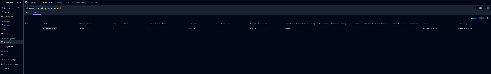

# Task 1

## Instructions

This project uses **Poetry** and **uv** for dependency management. Follow the steps below to set up and run the application.

### Prerequisites

1.  **Environment Variables**: Ensure you have a `.env` file in the project root with the following keys:
    ```env
    OPENAI_API_KEY=your_openai_api_key
    OPENAI_MODEL=gpt-4o-mini
    LANGFUSE_PUBLIC_KEY=your_langfuse_public_key
    LANGFUSE_SECRET_KEY=your_langfuse_secret_key
    LANGFUSE_HOST=http://localhost:3000
    ```
2.  **Qdrant**: The application expects a Qdrant vector store running at `http://localhost:6333`. You can run it via Docker:
    ```bash
    docker run -p 6333:6333 -p 6334:6334 \
        -v $(pwd)/qdrant_storage:/qdrant/storage:z \
        qdrant/qdrant
    ```
3.  **Langfuse**: The application uses Langfuse for tracing. You can run it locally via Docker Compose:
    ```bash
    # Clone the Langfuse repository
    git clone https://github.com/langfuse/langfuse.git
    cd langfuse

    # Run Langfuse using Docker Compose
    docker compose up -d
    ```
    Once running, you can access Langfuse at `http://localhost:3000`. Create a project and obtain your API keys (Public Key, Secret Key, and Host) to add to your `.env` file.

### Installation (Compiling)

You can use either Poetry or uv to install the project dependencies.

#### Using Poetry
```bash
poetry install
```

#### Using uv
```bash
uv sync
```

### Running the Application

After installation, you can run the assistant using the following commands:

#### Using Poetry
```bash
poetry run python main.py
# OR using the script defined in pyproject.toml
poetry run llm-evals
```

#### Using uv
```bash
uv run python main.py
# OR using the script defined in pyproject.toml
uv run llm-evals
```

### Project Structure Note
The application's core logic is located in `src/llm_evals/evals.py` and it is also mirrored in the root `main.py` for convenience. The `llm-evals` command points to the `main` function in `src/llm_evals/evals.py`.

## Evidence

