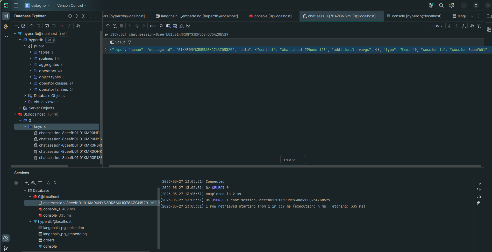
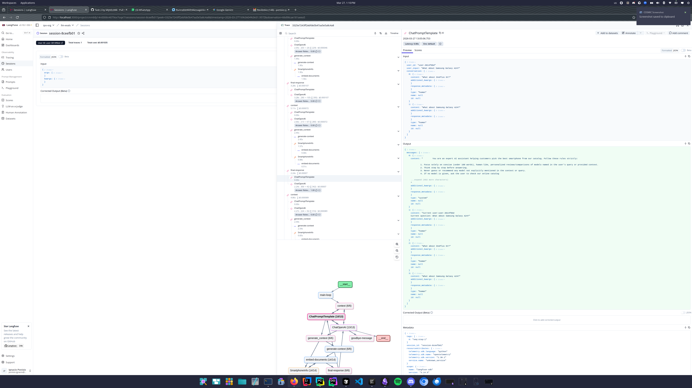

# Task 2

## Instructions

This project uses **Poetry** and **uv** for dependency management. Follow the steps below to set up and run the application.

### Prerequisites

1.  **Environment Variables**: Ensure you have a `.env` file in the project root with the following keys:
    ```env
    OPENAI_API_KEY=your_openai_api_key
    OPENAI_MODEL=gpt-4o-mini
    LANGFUSE_PUBLIC_KEY=your_langfuse_public_key
    LANGFUSE_SECRET_KEY=your_langfuse_secret_key
    LANGFUSE_HOST=http://localhost:3000
    ```
2.  **Qdrant**: The application expects a Qdrant vector store running at `http://localhost:6333`. You can run it via Docker:
    ```bash
    docker run -p 6333:6333 -p 6334:6334 \
        -v $(pwd)/qdrant_storage:/qdrant/storage:z \
        qdrant/qdrant
    ```
3.  **Langfuse**: The application uses Langfuse for tracing. You can run it locally via Docker Compose:
    ```bash
    # Clone the Langfuse repository
    git clone https://github.com/langfuse/langfuse.git
    cd langfuse

    # Run Langfuse using Docker Compose
    docker compose up -d
    ```
    Once running, you can access Langfuse at `http://localhost:3000`. Create a project and obtain your API keys (Public Key, Secret Key, and Host) to add to your `.env` file.

### Installation (Compiling)

You can use either Poetry or uv to install the project dependencies.

#### Using Poetry
```bash
poetry install
```

#### Using uv
```bash
uv sync
```

### Running the Application

After installation, you can run the assistant using the following commands:

#### Using Poetry
```bash
poetry run python main.py
# OR using the script defined in pyproject.toml
poetry run llm-evals
```

#### Using uv
```bash
uv run python main.py
# OR using the script defined in pyproject.toml
uv run llm-evals
```

### Project Structure Note
The application's core logic is located in `src/llm_evals/evals.py` and it is also mirrored in the root `main.py` for convenience. The `llm-evals` command points to the `main` function in `src/llm_evals/evals.py`.

## Evidence






```shell
Welcome to the Smartphone Assistant! I can help you with smartphone features and comparisons.
User @ session-8ceefb01: What about OnePlus 6t?
System @ session-8ceefb01: The OnePlus 6T offers a great balance of performance and value. Its Snapdragon processor ensures smooth multitasking, while the AMOLED display delivers vibrant colors and deep blacks for an immersive viewing experience. The battery life is impressive, typically lasting a full day, and the fast charging feature minimizes downtime. For photography, it provides solid low-light capabilities. If you're looking for a fast, reliable device without breaking the bank, the OnePlus 6T might be a great fit. Are there any specific features you're most interested in?
User @ session-8ceefb01: What about Samsung Galaxy A24?
System @ session-8ceefb01: I can't provide specific details about the Samsung Galaxy A24. I recommend checking our online catalog for the exact model name and details. If you have other models in mind or want a comparison, let me know!
User @ session-8ceefb01: What about IPhone 12?
System @ session-8ceefb01: The iPhone 12 offers a fantastic balance of performance and build quality. It features a stunning Super Retina XDR display, making media consumption a treat. The A14 Bionic chip ensures smooth multitasking and gaming. Its dual-camera system delivers impressive photos, especially in low light. With 5G capability, you’re future-ready for faster internet speeds. If you value a premium feel, great software support, and accessibility in the Apple ecosystem, the iPhone 12 is an excellent choice. What are you specifically looking for in a phone?
User @ session-8ceefb01: Which phone did I ask about first?
System @ session-8ceefb01: I can't help with that. However, if you're interested in comparing the OnePlus 6T, Samsung Galaxy A24, or iPhone 12, let me know!
User @ session-8ceefb01: Oppo Find X5 is a phone model, do you have information?
System @ session-8ceefb01: The Oppo Find X5 offers a stunning AMOLED display for vibrant colors and deep contrasts, enhancing gaming and media consumption. It boasts a robust camera system, delivering impressive low-light performance and sharp images. The strong battery life ensures you stay powered throughout your day, while fast charging gets you back on track quickly. It’s also 5G capable, giving you future-proof connectivity. If you have specific needs for performance or photography, let me know!
User @ session-8ceefb01: Which phone did I first ask about?
System @ session-8ceefb01: I can't help with identifying which phone you asked about first. If you have any questions about specific smartphone models, feel free to ask!
User @ session-8ceefb01: bye
-*-*-*-*-*-*-*-*-*-*-*-*-*-*-*-*-*-*-*-*
> How would you rate the relevance of my responses for trace_id 3325e7243ff2ebfde5b47aa5e5a8c4a8 (0-10)?: 9
> Would you like to add any comments?: :)
-*-*-*-*-*-*-*-*-*-*-*-*-*-*-*-*-*-*-*-*
System @ session-8ceefb01: Thank you so much for your feedback and for letting me assist you! It’s been a pleasure helping you. If you have more questions in the future, don’t hesitate to reach out. Take care!
                                                                                                                                                                                                                       
```