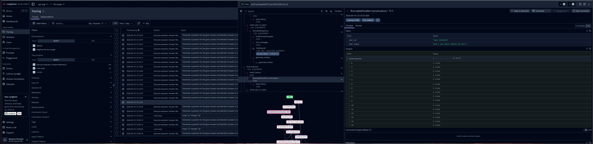

# Task 2

## Instructions

This project uses **Poetry** and **uv** for dependency management. Follow the steps below to set up and run the application.

### Prerequisites

1.  **Environment Variables**: Ensure you have a `.env` file in the project root with the following keys:
    ```env
    OPENAI_API_KEY=your_openai_api_key
    OPENAI_MODEL=gpt-4o-mini
    LANGFUSE_PUBLIC_KEY=your_langfuse_public_key
    LANGFUSE_SECRET_KEY=your_langfuse_secret_key
    LANGFUSE_HOST=http://localhost:3000
    ```
2.  **Qdrant**: The application expects a Qdrant vector store running at `http://localhost:6333`. You can run it via Docker:
    ```bash
    docker run -p 6333:6333 -p 6334:6334 \
        -v $(pwd)/qdrant_storage:/qdrant/storage:z \
        qdrant/qdrant
    ```
3.  **Langfuse**: The application uses Langfuse for tracing. You can run it locally via Docker Compose:
    ```bash
    # Clone the Langfuse repository
    git clone https://github.com/langfuse/langfuse.git
    cd langfuse

    # Run Langfuse using Docker Compose
    docker compose up -d
    ```
    Once running, you can access Langfuse at `http://localhost:3000`. Create a project and obtain your API keys (Public Key, Secret Key, and Host) to add to your `.env` file.

### Installation (Compiling)

You can use either Poetry or uv to install the project dependencies.

#### Using Poetry
```bash
poetry install
```

#### Using uv
```bash
uv sync
```

### Running the Application

After installation, you can run the assistant using the following commands:

#### Using Poetry
```bash
poetry run python main.py
# OR using the script defined in pyproject.toml
poetry run llm-evals
```

#### Using uv
```bash
uv run python main.py
# OR using the script defined in pyproject.toml
uv run llm-evals
```

### Project Structure Note
The application's core logic is located in `src/llm_evals/evals.py` and it is also mirrored in the root `main.py` for convenience. The `llm-evals` command points to the `main` function in `src/llm_evals/evals.py`.

## Evidence




```json
{
    "conversation": [
        {
            "content": "What about iphone 12?",
            "additional_kwargs": {},
            "response_metadata": {},
            "type": "human",
            "name": null,
            "id": null
        },
        {
            "content": "",
            "additional_kwargs": {
                "refusal": null
            },
            "response_metadata": {},
            "type": "ai",
            "name": null,
            "id": null,
            "tool_calls": [
                {
                    "name": "SmartphoneInfo",
                    "args": {
                        "model": "iphone 12",
                        "tool_call_id": "1"
                    },
                    "id": "call_gFhLEoq7HcVfeCcnAgKEFyDR",
                    "type": "tool_call"
                }
            ],
            "invalid_tool_calls": [],
            "usage_metadata": {
                "input_tokens": 189,
                "output_tokens": 24,
                "total_tokens": 213,
                "input_token_details": {
                    "audio": 0,
                    "cache_read": 0
                },
                "output_token_details": {
                    "audio": 0,
                    "reasoning": 0
                }
            }
        },
        {
            "content": "Model: Apple iPhone 12\nPrice: $597.69\nRating: 74.0\nSIM: Dual Sim, 3G, 4G, 5G, VoLTE, Wi-Fi, NFC\nProcessor: Bionic A14, Hexa Core, 3.1 GHz Processor\nRAM: 4 GB RAM, 64 GB inbuilt\nBattery: 6.1 inches, 1170 x 2532 px Display with Large Notch\nDisplay: 12 MP + 12 MP Dual Rear & 12 MP Front Camera\nCamera: Memory Card Not Supported\nCard: iOS v14\nOS: No FM Radio\nIn Stock: True",
            "additional_kwargs": {},
            "response_metadata": {},
            "type": "tool",
            "name": null,
            "id": null,
            "tool_call_id": "call_gFhLEoq7HcVfeCcnAgKEFyDR",
            "artifact": null,
            "status": "success"
        },
        {
            "content": "What about iphone 12?",
            "additional_kwargs": {},
            "response_metadata": {},
            "type": "human",
            "name": null,
            "id": null
        },
        {
            "content": "The iPhone 12 offers a smooth performance with its A14 Bionic chip, great for multitasking and gaming. Its 6.1-inch Super Retina XDR display provides vibrant colors and deep blacks for an immersive viewing experience. The camera setup excels in photographing and videography, especially in low light. With 5G connectivity, you'll enjoy faster download speeds. The battery life is solid, comfortably getting you through a day. Overall, if you're looking for a powerful, reliable smartphone with excellent camera performance and display, the iPhone 12 is a great choice! What are your specific needs?",
            "additional_kwargs": {
                "refusal": null
            },
            "response_metadata": {},
            "type": "ai",
            "name": null,
            "id": null,
            "tool_calls": [],
            "invalid_tool_calls": [],
            "usage_metadata": {
                "input_tokens": 483,
                "output_tokens": 121,
                "total_tokens": 604,
                "input_token_details": {
                    "audio": 0,
                    "cache_read": 0
                },
                "output_token_details": {
                    "audio": 0,
                    "reasoning": 0
                }
            }
        },
        {
            "content": "And oneplus 6t?",
            "additional_kwargs": {},
            "response_metadata": {},
            "type": "human",
            "name": null,
            "id": null
        },
        {
            "content": "",
            "additional_kwargs": {
                "refusal": null
            },
            "response_metadata": {},
            "type": "ai",
            "name": null,
            "id": null,
            "tool_calls": [
                {
                    "name": "SmartphoneInfo",
                    "args": {
                        "model": "oneplus 6t",
                        "tool_call_id": "2"
                    },
                    "id": "call_JU6NZBP22pZTJveFNlbfutVT",
                    "type": "tool_call"
                }
            ],
            "invalid_tool_calls": [],
            "usage_metadata": {
                "input_tokens": 510,
                "output_tokens": 26,
                "total_tokens": 536,
                "input_token_details": {
                    "audio": 0,
                    "cache_read": 0
                },
                "output_token_details": {
                    "audio": 0,
                    "reasoning": 0
                }
            }
        },
        {
            "content": "Model: OnePlus 10T\nPrice: $517.23\nRating: 85.0\nSIM: Dual Sim, 3G, 4G, 5G, VoLTE, Wi-Fi, NFC\nProcessor: Snapdragon 8+ Gen1, Octa Core, 3.2 GHz Processor\nRAM: 8 GB RAM, 128 GB inbuilt\nBattery: 4800 mAh Battery with 150W Fast Charging\nDisplay: 6.7 inches, 1080 x 2412 px, 120 Hz Display with Punch Hole\nCamera: 50 MP + 8 MP + 2 MP Triple Rear & 16 MP Front Camera\nCard: Memory Card Not Supported\nOS: No FM Radio\nIn Stock: True",
            "additional_kwargs": {},
            "response_metadata": {},
            "type": "tool",
            "name": null,
            "id": null,
            "tool_call_id": "call_JU6NZBP22pZTJveFNlbfutVT",
            "artifact": null,
            "status": "success"
        },
        {
            "content": "And oneplus 6t?",
            "additional_kwargs": {},
            "response_metadata": {},
            "type": "human",
            "name": null,
            "id": null
        },
        {
            "content": "It seems you're interested in the OnePlus 6T, but I found the OnePlus 10T as well. The OnePlus 10T boasts a powerful Snapdragon 8+ Gen1 processor, giving you excellent performance for gaming and multitasking. Its 6.7-inch 120 Hz display provides smooth visuals, great for watching videos or gaming. With a 4800 mAh battery and 150W fast charging, you won't have to worry about running out of power quickly. The 50 MP triple camera setup enhances your photography experience. If you prefer the OnePlus 6T specifically, please confirm, and I'll focus on that model!",
            "additional_kwargs": {
                "refusal": null
            },
            "response_metadata": {},
            "type": "ai",
            "name": null,
            "id": null,
            "tool_calls": [],
            "invalid_tool_calls": [],
            "usage_metadata": {
                "input_tokens": 480,
                "output_tokens": 132,
                "total_tokens": 612,
                "input_token_details": {
                    "audio": 0,
                    "cache_read": 0
                },
                "output_token_details": {
                    "audio": 0,
                    "reasoning": 0
                }
            }
        },
        {
            "content": "Which phone did I ask about first?",
            "additional_kwargs": {},
            "response_metadata": {},
            "type": "human",
            "name": null,
            "id": null
        },
        {
            "content": "You first asked about the OnePlus 6T.",
            "additional_kwargs": {
                "refusal": null
            },
            "response_metadata": {},
            "type": "ai",
            "name": null,
            "id": null,
            "tool_calls": [],
            "invalid_tool_calls": [],
            "usage_metadata": {
                "input_tokens": 543,
                "output_tokens": 12,
                "total_tokens": 555,
                "input_token_details": {
                    "audio": 0,
                    "cache_read": 0
                },
                "output_token_details": {
                    "audio": 0,
                    "reasoning": 0
                }
            }
        },
        {
            "content": "Which phone did I ask about first?",
            "additional_kwargs": {},
            "response_metadata": {},
            "type": "human",
            "name": null,
            "id": null
        },
        {
            "content": "I’m unable to track previous queries. Please let me know the smartphone models you want to compare or discuss!",
            "additional_kwargs": {
                "refusal": null
            },
            "response_metadata": {},
            "type": "ai",
            "name": null,
            "id": null,
            "tool_calls": [],
            "invalid_tool_calls": [],
            "usage_metadata": {
                "input_tokens": 435,
                "output_tokens": 22,
                "total_tokens": 457,
                "input_token_details": {
                    "audio": 0,
                    "cache_read": 0
                },
                "output_token_details": {
                    "audio": 0,
                    "reasoning": 0
                }
            }
        },
        {
            "content": "Did I ask about Iphone earlier?",
            "additional_kwargs": {},
            "response_metadata": {},
            "type": "human",
            "name": null,
            "id": null
        },
        {
            "content": "No, you haven't asked about an iPhone earlier in the conversation. You only asked about the OnePlus 6T.",
            "additional_kwargs": {
                "refusal": null
            },
            "response_metadata": {},
            "type": "ai",
            "name": null,
            "id": null,
            "tool_calls": [],
            "invalid_tool_calls": [],
            "usage_metadata": {
                "input_tokens": 402,
                "output_tokens": 26,
                "total_tokens": 428,
                "input_token_details": {
                    "audio": 0,
                    "cache_read": 0
                },
                "output_token_details": {
                    "audio": 0,
                    "reasoning": 0
                }
            }
        }
    ]
}

```